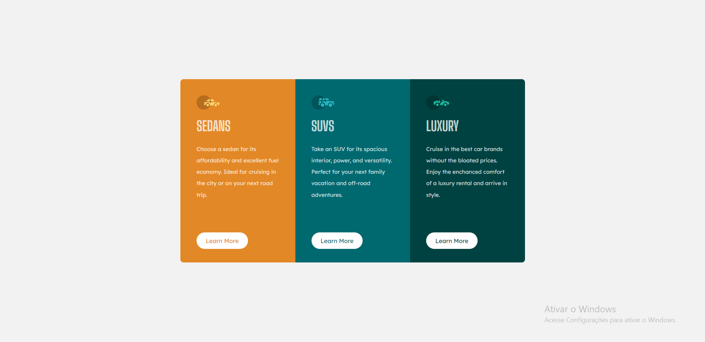
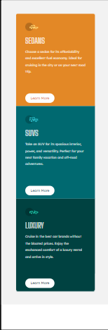

# 3 column preview card component

Este é um site desenvolvido apartir do desafio Front-end Mentor

<a href="https://www.frontendmentor.io/challenges/3column-preview-card-component-pH92eAR2-/hub" target="_blank"> https://www.frontendmentor.io/challenges/3column-preview-card-component-pH92eAR2-/hub</a>

Este projeto foi feito para estudo próprio, com apredizagem das propriedades em CSS: FLEBOX e GRID.

## Imagens do projeto
Desktop: 

Mobile:

## Desafio que tive neste projeto:

Tanto o design do desktop quanto mobile foi fácil de ser feito.
## Tecnologias usadas:
- Html
- CSS

## Redes socias:
- <a href="https://github.com/JhonpsDias" target="_blank">Git Hub</a>

- <a href="https://www.linkedin.com/in/jo%C3%A3o-pedro-dias-castro-a795a0295/">Linkedin</a>

Projeto feito por - <i>João Pedro Dias Castro</i>